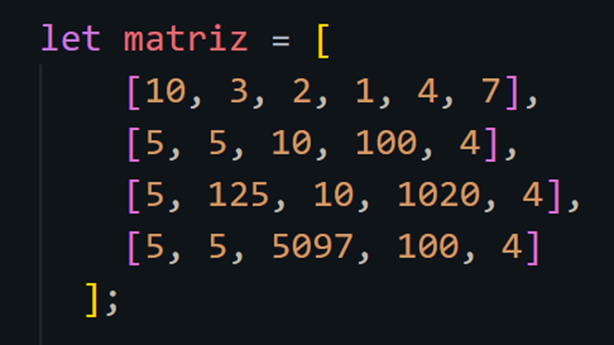
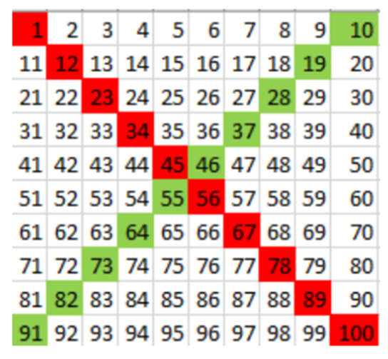

# Actividades Clase Numero 12

¡Hola, chicas! 😁🙌✨✨
¡Bienvenidas a la clase 12!
Hoy seguiremos expandiendo nuestro conocimiento de JavaScript 🛠️ para que nuestro código sea más versátil y poderoso. 🌟

## Temas de hoy:
🔁 Ciclos `while` y `do while`: aprenderemos a repetir tareas de forma eficiente usando condiciones.
📋 Arrays: trabajaremos con listas de datos 🗂️, cómo crearlas, acceder a sus elementos y utilizarlas en nuestros programas.
🔢 Matrices (o arrays dentro de arrays): organizaremos información más compleja con estructuras bidimensionales.

💡 **Objetivo de la clase:** entender estos conceptos básicos pero fundamentales para resolver problemas de programación 🚀.

¡Prepárense para practicar, experimentar y divertirnos mientras aprendemos juntas! 💻✨

**Importante:**
En todos los casos en que se reciban parámetros, utilizar el `prompt` para el ingreso por consola de los valores.

---

## Actividades:

### Ejercicio 1: While
Crea un programa que solicite al usuario ingresar números continuamente hasta que el usuario ingrese un número negativo. Luego, imprime la suma de todos los números ingresados.

### Ejercicio 2: Do While
Escribe un programa que solicite al usuario ingresar una contraseña. Si la contraseña es incorrecta, debe volver a pedirla hasta que el usuario ingrese la correcta. La contraseña correcta es "1234".

### Ejercicio 3: Ciclo For
Nuestra tarea es contar la cantidad de números impares que hay desde el número 0 hasta un número X (inclusive). Para esto, debes seguir los siguientes pasos:

1.  Solicitar al usuario que ingrese un número X.
2.  Inicializar una variable para contar los números impares.
3.  Utilizar un ciclo `for` para recorrer los números desde 0 hasta X (inclusive).
4.  Dentro del ciclo, verificar si el número es impar.
5.  Si el número es impar, incrementar el contador de números impares.
6.  Al finalizar el ciclo, imprimir en consola la cantidad de números impares encontrados.
7.  Utiliza el operador módulo (`%`) para verificar si un número es impar.
8.  **Ejemplo de Ejecución:** Si el usuario ingresa 10, el programa debe imprimir: “La cantidad de números impares desde 0 hasta 10 (inclusive) es: 5”

### Ejercicio 4: Ciclo For - Array
Crear un programa que permita registrar las notas de varios estudiantes usando arrays y mostrarlas por pantalla:

1.  Crear un array para almacenar las notas.
2.  Define un array vacío llamado `notas` donde almacenaremos las notas de los estudiantes.
3.  Pide al usuario que ingrese las notas de varios estudiantes una por una utilizando el método `prompt`.
4.  Usa un bucle `for` para solicitar las notas y asignarlas directamente a posiciones específicas del array `notas`.
5.  Imprime en consola las notas ingresadas usando el array `notas`.

### Ejercicio 5: Uso de Arrays y Condicionales
Crea un programa que solicite al usuario ingresar 5 nombres y los almacene en un array. Luego, solicita al usuario ingresar un nombre y verifica si ese nombre se encuentra en el array. (Pueden desglosar en pasos el código si eso les facilita su desarrollo)

### Ejercicio 6: Iguales a 10 pero menores de 1000
Dada una matriz, recorrer sus valores y sumar solo los números que estén por encima o sean iguales a 10, pero menores que 1000.



### Ejercicio 7: Matriz 5x5
Declara una variable que contenga una matriz de 5x5 llena de puros números enteros y positivos. Luego, escribe un algoritmo para sumar todos los números en la matriz.

### Ejercicio 8: Rojo y Verde
Para este ejercicio vamos a generar dos funciones:
a. Una va a sumar los valores en la diagonal marcada en rojo.
b. La otra va a marcar los valores de la diagonal marcada en verde.
Ambas funciones deben devolver un resultado único.
Rojo: 505
Verde: 505

**IMPORTANTE:** Para hacer este ejercicio, tendrán que investigar sobre el método `push` en los Arrays. ¡Este método lo veremos en las próximas clases, pero si desean pueden investigarlo para resolver este desafío!



### Ejercicio 9: Última aparición de un modelo de auto
Se está realizando el desarrollo de una aplicación para control de gastos. Cada día, el usuario ingresa sus gastos cotidianos.
La idea es solo registrar el total de los gastos, al finalizar la jornada.
Para simplificar, vamos a considerar que todos los meses tienen cuatro semanas.
Los gastos estarán en una matriz de 4x7, cada fila representa una semana y cada columna un día. Es decir, fila 0, semana 1, fila 1, semana 2, etc. Columna 0, día 1, columna 1, día 2, etcétera.

a. Lo que nos solicitan es dar el total de gastos en una semana. Recordemos que cada fila representa una semana, es decir, si nos indican semana 2 tenemos que sumar la fila 1 de la matriz. Recordar que las matrices comienzan siempre en posición 0.
b. La aplicación también tendrá una parte de estadísticas, para esto nos solicitan dar el total de un día en particular, por ejemplo del día 3, acá también tengamos en cuenta lo que ocurre con las filas, ya que las columnas también comienzan en 0.
c. Por último, es necesario tener el total de gastos realizados en el mes.

*✔ Pregunta para pensar, ¿es lo mismo recorrer por filas o por columnas para resolver este último punto?*

d. Obtener cuál fue la semana que más gastos se realizaron. Indicar el día que más gastos se realizaron.

*✔ Posibles matrices para comprobar los resultados.*

|           | Día 1 | Día 2 | Día 3 | Día 4 | Día 5 | Día 6 | Día 7 |
|-----------|-------|-------|-------|-------|-------|-------|-------|
| Semana 1  | 1135  | 2500  | 900   | 1600  | 2800  | 3650  | 1100  |
| Semana 2  | 1750  | 1890  | 1900  | 1300  | 898   | 1750  | 2800  |
| Semana 3  | 1700  | 1150  | 1690  | 1900  | 1770  | 4500  | 2560  |
| Semana 4  | 800   | 1250  | 1430  | 2100  | 1980  | 1270  | 950   |

```