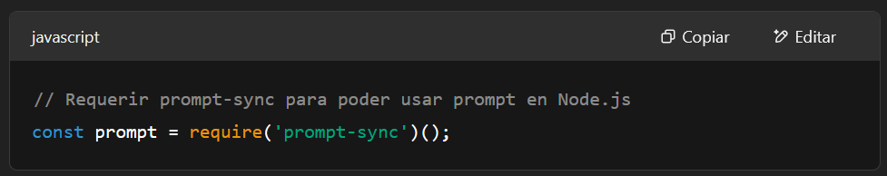
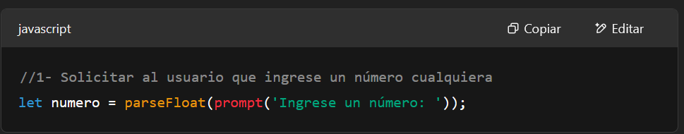
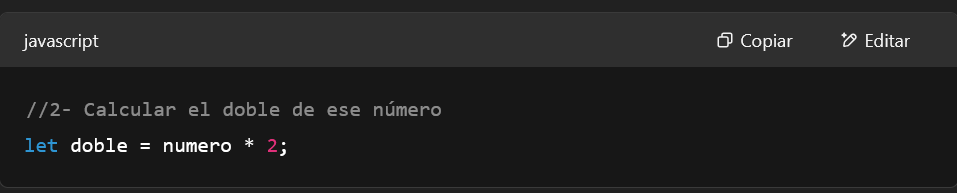
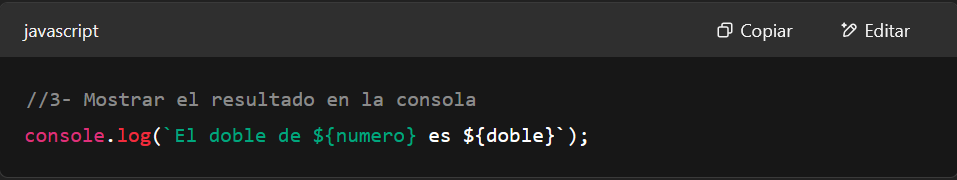
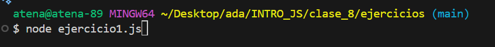

# Documentación del Código: Ejercicio 1 - Calcular el Doble de un Número

## Descripción General

Este script de JavaScript está diseñado para calcular el doble de un número proporcionado por el usuario. El programa solicita una entrada numérica, realiza una operación aritmética simple (multiplicación) y luego muestra el resultado en la consola. Este ejercicio es fundamental para comprender la captura de datos del usuario, el almacenamiento en variables y la manipulación básica de datos.

---

## Requisitos Previos

Para ejecutar este código en un entorno **Node.js**, es necesario contar con el paquete `prompt-sync`. Este módulo permite utilizar la función `prompt()`, similar a como funciona en los navegadores web, para solicitar información al usuario directamente desde la consola.

Si no tienes instalado `prompt-sync`, puedes añadirlo a tu proyecto ejecutando el siguiente comando en tu terminal:

```bash
npm install prompt-sync
```

## Funcionamiento del Código

El script sigue una secuencia lógica de tres pasos principales:

1️⃣ Inicialización de prompt-sync



Propósito: Esta línea importa e inicializa el módulo prompt-sync.
Detalle: 

    La función require('prompt-sync') carga el módulo, y el () al final lo instancia, permitiendo que la variable prompt se use como una función para capturar la entrada del usuario.

2️⃣ Solicitud de Entrada del Usuario



Propósito: Se pide al usuario que ingrese un número.
Detalle: 
    
    prompt('Ingrese un número: '): Muestra el mensaje "Ingrese un número: " en la consola y espera a que el usuario escriba algo y presione Enter.

    La entrada recibida por prompt() es siempre una cadena de texto.

    parseFloat(...): Convierte la cadena de texto ingresada por el usuario a un número decimal. Esto es crucial para asegurar que las operaciones matemáticas se realicen correctamente.
    Si el usuario ingresa un texto que no puede convertirse a número (ej: "hola"), parseFloat devolverá NaN (Not a Number).

    let numero = ...: El número convertido se almacena en la variable numero.

3️⃣ Cálculo del Doble



Propósito: Se calcula el doble del número ingresado.
Detalle:

    numero * 2: Se utiliza el operador aritmético de multiplicación (*) para multiplicar el valor almacenado en la variable numero por 2.

    let doble = ...: El resultado de esta multiplicación se almacena en una nueva variable llamada doble.

4️⃣ Visualización del Resultado



Propósito: Se muestra el resultado del cálculo en la consola.
Detalle:

    console.log(): Es la función estándar en JavaScript para imprimir mensajes en la consola.

    `El doble de ${numero} es ${doble}`: Se utiliza una plantilla de cadena (template literal) para construir el mensaje de salida.
    Las expresiones ${numero} y ${doble} se reemplazan por los valores actuales de estas variables.
    Esto permite mostrar un mensaje claro y formateado al usuario.

🚀 Ejecución del Script

Para ejecutar este script:

    Guarda el código en un archivo con extensión .js (por ejemplo, calcularDoble.js).

    Asegúrate de tener Node.js instalado en tu sistema.

    Abre una terminal o línea de comandos.

    Navega hasta el directorio donde guardaste el archivo.

    Ejecuta el script con el comando:



    El programa te solicitará que ingreses un número. Escríbelo y presiona Enter.

    Verás el resultado del cálculo impreso en la consola.

🏁 Resumen

Este script es un ejemplo básico pero completo de cómo interactuar con el usuario, procesar datos y mostrar resultados en JavaScript utilizando Node.js.
Cubre conceptos clave como variables, tipos de datos (y su conversión), operadores aritméticos y entrada/salida básica.